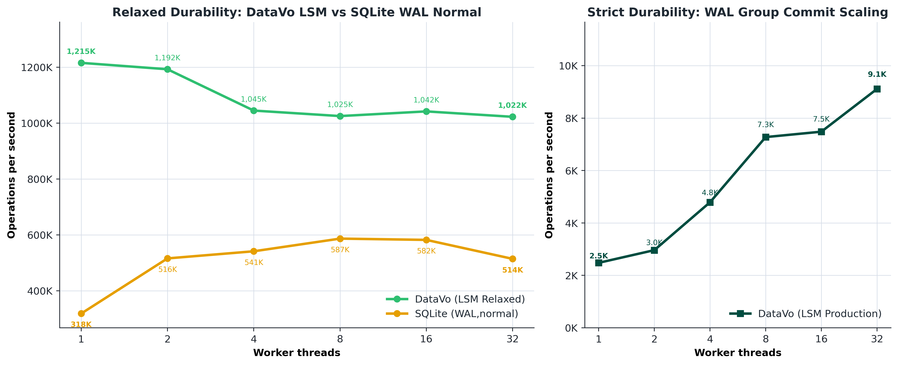
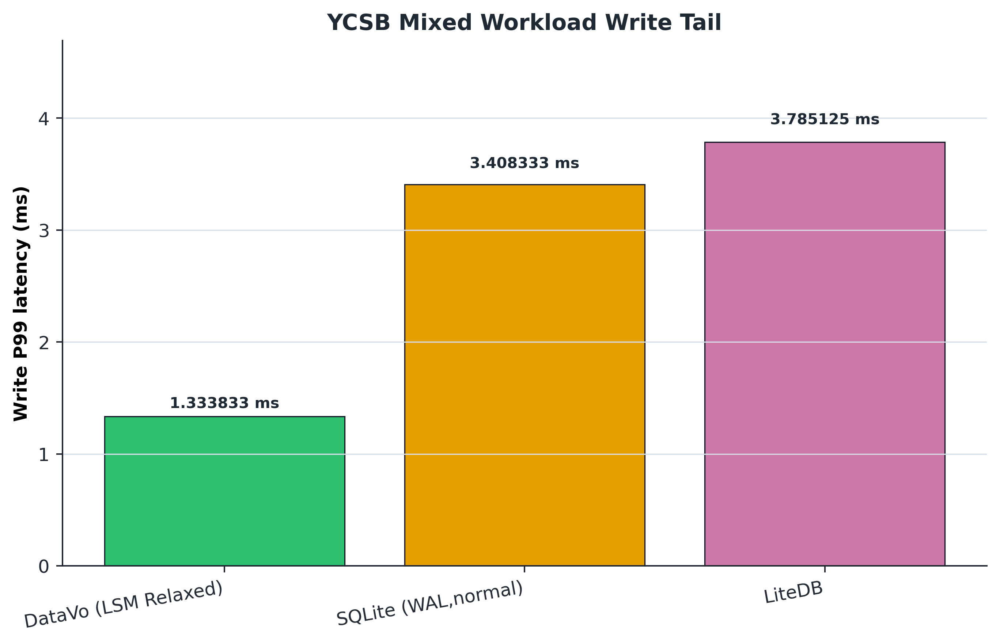
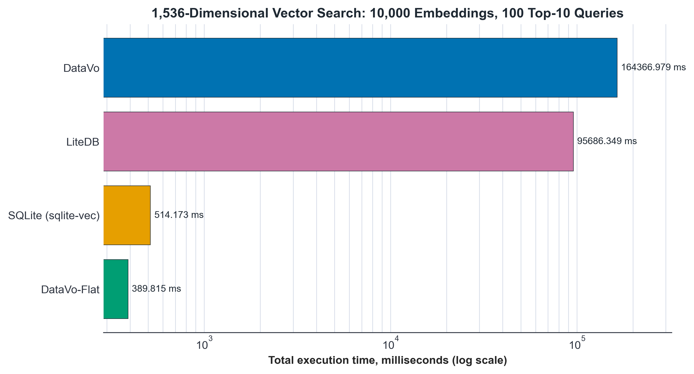
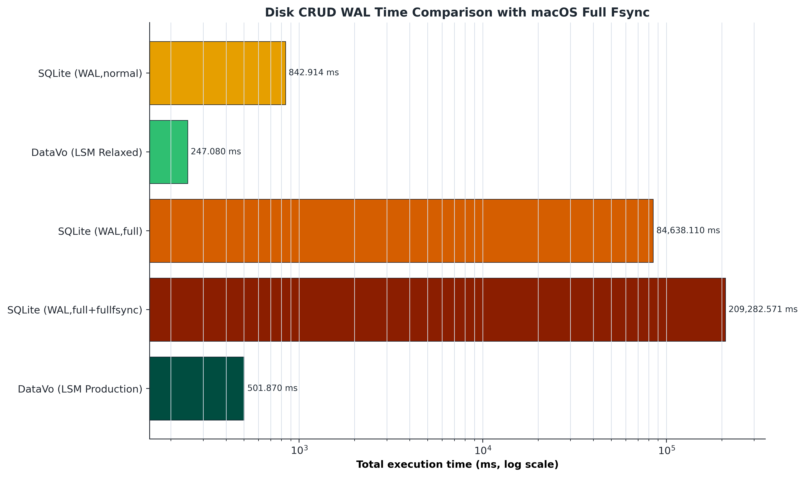
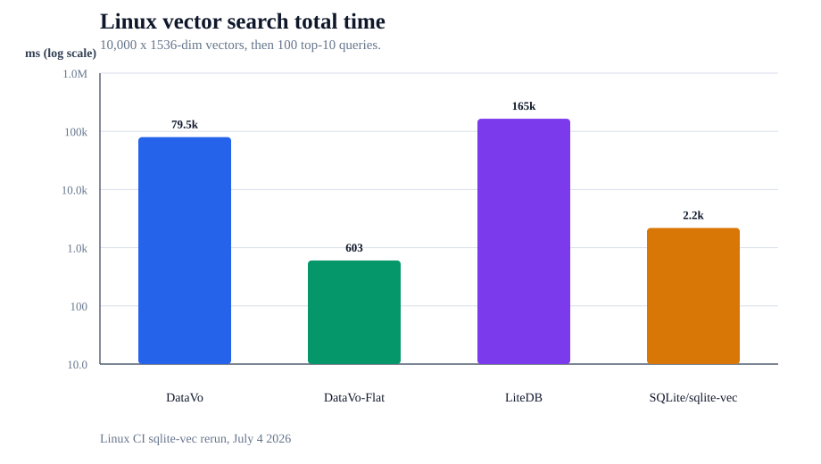
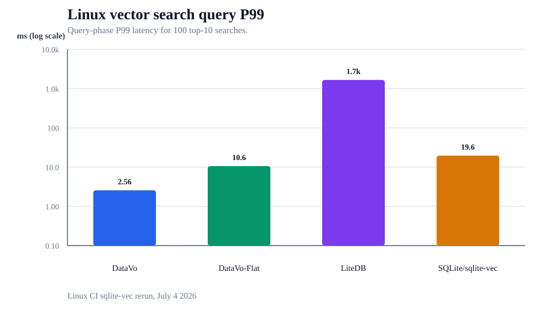
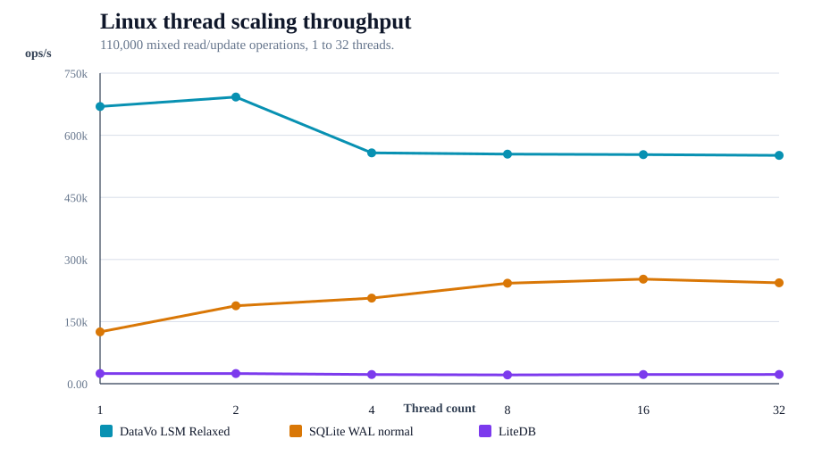

# DataVo

[](LICENSE)
[](docs/index.md)
[](#install-with-nuget)
[](#install-with-npm)

DataVo is an embeddable SQL engine for .NET, designed for local-first applications, game tooling, and browser-native workflows.

Use DataVo when you want:

- predictable in-process SQL execution
- no mandatory external DB service for local scenarios
- one engine across desktop, backend, and browser/WebAssembly experiences

## Why customers use DataVo

- Embedded SQL runtime with in-memory and disk-backed storage
- Built in C# with deterministic behavior and testable execution paths
- Security and auth SQL commands for principal and grant management
- Browser and WebAssembly support for interactive and local-first applications
- Integration direction for ADO.NET and Entity Framework workflows

## Benchmarks

The current benchmark suite was rerun on July 3, 2026 with `.NET 10.0.103` on macOS arm64 / Apple Silicon. Treat these as local benchmark results, not universal database rankings: storage mode, durability setting, hardware, filesystem behavior, native extensions, and workload shape all matter.

An additional GitHub Actions Linux snapshot from July 4, 2026 is appended in the detailed benchmark docs; it is kept separate from the macOS headline measurements.

The most important distinction is durability. `DataVo LSM Production` uses strict WAL fsync before acknowledging writes. `DataVo LSM Relaxed` is an OS-buffered throughput ceiling for caches, rebuildable data, and research workloads; it does not have the same power-loss contract as strict mode.

Highlights from the checked-in benchmark docs:

- `1,215,413 ops/s` at one thread for DataVo LSM Relaxed in the thread-scaling workload, with roughly a 1M ops/s plateau through 32 threads.
- `626,690 ops/s` on the YCSB mixed workload, with `1.333833 ms` write P99 latency in relaxed LSM mode.
- `501.870 ms` total time for strict-fsync DataVo LSM Production in the disk CRUD WAL workload, versus `842.914 ms` for SQLite WAL normal in the same run.
- `10.331 MB` allocated by the DataVo-Flat vector path for 10,000 vectors x 1536 dimensions and 100 top-10 queries; DataVo HNSW allocated `157.246 MB`, SQLite/sqlite-vec allocated `63.427 MB`, and LiteDB allocated `208,915.002 MB`.

Linux CI sqlite-vec rerun highlights:

- SQLite/sqlite-vec now runs in CI with `SQLITE_VEC_PATH` set to the pinned Linux x86_64 `vec0.so` extension.
- On the Linux vector workload, DataVo HNSW reported `2.557093 ms` query P99, DataVo-Flat reported `602.778 ms` total time, and SQLite/sqlite-vec reported `2,186.128 ms` total time with `19.589254 ms` query P99.
- On Linux thread scaling, DataVo LSM Relaxed reported `692,373 ops/s` at two threads and stayed above `551,000 ops/s` through 32 threads.

macOS arm64 headline plots:









Linux CI sqlite-vec rerun plots:







More detail, including scenario commands and caveats: [docs/manual/performance/benchmarks.md](docs/manual/performance/benchmarks.md).

## Install with NuGet

### Public feed (planned)

When published, installation will follow the standard NuGet flow:

```bash
dotnet add package DataVo.Core
dotnet add package DataVo.Data
dotnet add package DataVo.EntityFrameworkCore
# Optional, for source-generated compiled queries:
dotnet add package DataVo.Generators
```

### Publishing packages

The repository is already pack-ready for the preview packages. Build and pack from the repository root:

```bash
dotnet restore DataVo.sln
dotnet pack DataVo.Core/DataVo.Core.csproj -c Release --no-restore
dotnet pack DataVo.Data/DataVo.Data.csproj -c Release --no-restore
dotnet pack DataVo.EntityFrameworkCore/DataVo.EntityFrameworkCore.csproj -c Release --no-restore
dotnet pack DataVo.Generators/DataVo.Generators.csproj -c Release --no-restore
```

Publish with a NuGet API key configured in the environment:

```bash
dotnet nuget push "artifacts/packages/*.nupkg" \
  --api-key "$NUGET_API_KEY" \
  --source https://api.nuget.org/v3/index.json \
  --skip-duplicate
```

Push symbol packages separately only if symbol publishing is part of the release process:

```bash
dotnet nuget push "artifacts/packages/*.snupkg" \
  --api-key "$NUGET_API_KEY" \
  --source https://api.nuget.org/v3/index.json \
  --skip-duplicate
```

## Vector search example

Get started with similarity search on embeddings:

```csharp
using DataVo.Data;

using var connection = new DataVoConnection("StorageMode=Disk;DataSource=Products");
connection.Open();

using var create = connection.CreateCommand();
create.CommandText = @"
  CREATE TABLE Items (
    Id INT PRIMARY KEY,
    Name VARCHAR(100),
    Vector VECTOR(3)
  )";
create.ExecuteNonQuery();

// Create vector index for fast approximate nearest-neighbor search
using var index = connection.CreateCommand();
index.CommandText = "CREATE INDEX IX_Items_Vector ON Items (Vector) USING HNSW";
index.ExecuteNonQuery();

// Insert embeddings. Vector values are currently passed as SQL vector literal strings.
string embedding = "[0.1,0.2,0.3]";
using var insert = connection.CreateCommand();
insert.CommandText = "INSERT INTO Items VALUES (@id, @name, @vec)";
insert.Parameters.AddWithValue("@id", 1);
insert.Parameters.AddWithValue("@name", "Widget");
insert.Parameters.AddWithValue("@vec", embedding);
insert.ExecuteNonQuery();

// Find similar items (automatic HNSW ANN search)
string queryVector = "[0.2,0.1,0.4]";
using var search = connection.CreateCommand();
search.CommandText = @"
  SELECT Id, Name, Vector <=> @query AS similarity
  FROM Items
  ORDER BY similarity ASC
  LIMIT 10
";
search.Parameters.AddWithValue("@query", queryVector);

using var similar = search.ExecuteReader();
while (similar.Read())
{
  Console.WriteLine($"{similar["Id"]}: {similar["Name"]} ({similar["similarity"]})");
}
```

### Entity Framework (example)

DataVo supports regular LINQ for non-vector queries and now supports vector distance translation in native preview via `DataVoVectorDbFunctions`:

```csharp
using DataVo.EntityFrameworkCore;
using Microsoft.EntityFrameworkCore;

public class AppDbContext : DataVoDbContext
{
  public DbSet<ItemEmbedding> Items { get; set; }

  protected override void OnConfiguring(DbContextOptionsBuilder optionsBuilder)
    => optionsBuilder.UseDataVo("./embeddings.db");
}

public class ItemEmbedding
{
  public int Id { get; set; }
  public string Name { get; set; }
  public float[] Vector { get; set; } // maps to VECTOR(3)
}

using var ef = new AppDbContext();
float[] q = new float[] { 1f, 0f, 0f };

// Normal LINQ (non-vector)
var activeNames = ef.Items
  .Where(x => x.Id > 0)
  .Select(x => x.Name)
  .ToList();

// LINQ vector distance (native translation preview)
var similar = ef.QueryFromDataVo<ItemEmbedding>(s => s
  .OrderBy(x => DataVoVectorDbFunctions.CosineDistance(EF.Functions, x.Vector, q))
  .Take(5));

foreach (var r in similar)
  Console.WriteLine($"{r.Id}: {r.Name}");
```

### Local feed (available now)

```bash
dotnet pack DataVo.sln -c Release
dotnet add package DataVo.Core --source ./artifacts/packages
dotnet add package DataVo.Data --source ./artifacts/packages
```

## Install with npm

### Public package (planned)

For JavaScript and TypeScript consumers, the public npm package will follow this flow:

```bash
npm install @datavo/wasm
```

### Browser/WASM assets (available now)

```bash
bash ./scripts/deploy-browser-wasm.sh
cd docs
npm install
npm run docs:dev
```

This provides the current browser runtime and playground experience while npm distribution is being finalized.

## 60-second example

```csharp
using DataVo.Core;
using DataVo.Core.StorageEngine.Config;

using var db = new DataVoContext(new DataVoConfig
{
    StorageMode = StorageMode.InMemory
});

db.Execute("CREATE DATABASE Demo");
db.Execute("USE Demo");
db.Execute("CREATE TABLE Users (Id INT PRIMARY KEY, Name VARCHAR(50))");
db.Execute("INSERT INTO Users VALUES (1, 'Alice')");

var result = db.Execute("SELECT * FROM Users ORDER BY Id");
```

## End-user scenarios

### .NET application teams

- Embed SQL capabilities directly into services and desktop applications.

### AI and ML applications

- Semantic search on document embeddings (RAG, LLM applications)
- Vector-based recommendation engines
- Similarity matching without external vector databases
- Hybrid neural-lexical search combining text and vector similarity

### Unity and Godot developers

- Use DataVo as a local gameplay/profile/state database.
- Keep persistence and query behavior deterministic across development environments.
- Reuse the same SQL surface in tools and runtime workflows.

### Browser and WebAssembly products

- Run DataVo in a browser-backed runtime for demos, sandboxes, and local-first UX.
- Use the same core SQL workflows in docs, prototypes, and product surfaces.

### Entity Framework adopters

- Use the DataVo EF integration path for model-driven workflows.
- Follow the integration docs for current capability boundaries and roadmap status.

## Implemented SQL surface (high level)

- Querying and DML: `SELECT`, `INSERT`, `UPDATE`, `DELETE`
- DDL: `CREATE TABLE`, `CREATE INDEX`, `ALTER TABLE` (supported operations)
- Transactions: `BEGIN`, `COMMIT`, `ROLLBACK`
- Security/auth:
  - `CREATE USER`, `CREATE ROLE`
  - `GRANT`, `REVOKE`
  - `LOGIN`, `LOGOUT`
  - `SHOW USERS`, `SHOW ROLES`, `SHOW GRANTS`
- Vector search and indexing:
  - `VECTOR(n)` column type with fixed dimensionality
  - `CREATE INDEX ... USING HNSW` for approximate nearest-neighbor
  - Distance operators: `<->` for L2 and `<=>` for cosine
  - Hybrid queries (vector + lexical filters + joins)
  - Exact brute-force and fast ANN modes

## Documentation

- Product docs: [docs/index.md](docs/index.md)
- Setup and packaging: [docs/features/setup-and-packaging.md](docs/features/setup-and-packaging.md)
- WebAssembly and npm integration: [docs/features/wasm-and-npm.md](docs/features/wasm-and-npm.md)
- Unity and Godot integration: [docs/features/unity-and-godot.md](docs/features/unity-and-godot.md)
- Entity Framework integration: [docs/features/entity-framework.md](docs/features/entity-framework.md)
- Vector search guide: [docs/features/vector-queries-guide.md](docs/features/vector-queries-guide.md) — Complete guide to vector columns, distance metrics, exact vs. ANN search
- Query features: [docs/features/select-and-querying.md](docs/features/select-and-querying.md)
- Schema and DDL: [docs/features/schema-and-ddl.md](docs/features/schema-and-ddl.md)

## Status

DataVo is preview software aimed at local-first and embeddable database scenarios.

- Local package distribution is available now.
- Browser/WebAssembly runtime support is available now.
- Public NuGet and npm publication are in deployment preparation.
- Production-hardening work is active; validate representative workloads before production adoption.

## License

MIT. See [LICENSE](LICENSE).
