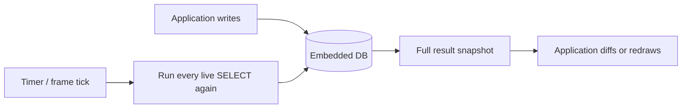
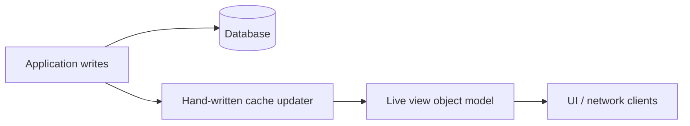
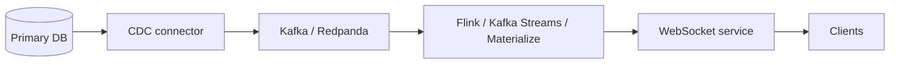
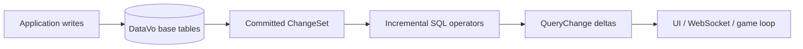

# Architecture Comparison

This document defines the rival architectures used by the realtime demos. The goal is to compare
systems honestly: DataVo is strongest when the workload is a local live view with frequent small
mutations, not when measuring raw SQL throughput in isolation.

## Architecture A: SQLite-Style Polling

Strengths:

- simple and proven
- excellent embedded deployment story
- no background services

Costs:

- every tick scans or indexes into the base tables again
- app code owns invalidation and diffing
- bytes returned scale with view size, not mutation size

Best baseline metric:

- `pollingRowsReturned` versus `reactiveDeltas.totalRows`

## Architecture B: App-Maintained Cache

Strengths:

- can be very fast for one carefully designed view
- avoids SQL overhead in the hot path

Costs:

- every view becomes bespoke code
- joins, distinct, aggregates, recursion, and top-k become correctness traps
- cache bugs are usually application bugs, not database bugs

Best baseline metric:

- engineering complexity and correctness coverage, not only latency

## Architecture C: External Streaming Stack

Strengths:

- distributed scale
- durable streams
- strong fit for cross-service event processing

Costs:

- brokers, connectors, schemas, stream jobs, deployment, and operations
- network serialization is mandatory
- not zero-friction for local-first apps, game tools, or browser demos

Best baseline metric:

- operational components required to deliver the same live view

## Architecture D: DataVo Reactive

Strengths:

- one in-process database
- SQL defines the view
- callback receives `added`, `removed`, `updatedBefore`, and `updated`
- result traffic scales with changed output rows
- deterministic drain point through `DispatchPendingNotifications()`

Costs:

- maintained views hold operator state
- currently no shared arrangements across many equivalent subscriptions
- JavaScript/WASM export for reactive subscription is still a next step

Best metric:

- `viewMaintenanceLatency.p99Ms` and `reactiveDeltas.totalRows`

## Research Link

- DBSP explains the delta model: full query snapshots are a stream, and maintained views can be
  updated by pushing differences through operators.
- Noria shows the backend-serving version of the same idea: maintain read views instead of
  rebuilding them for every request.
- Shared Arrangements is the obvious future optimization when many subscriptions share the same
  base indexes or join arrangements.
