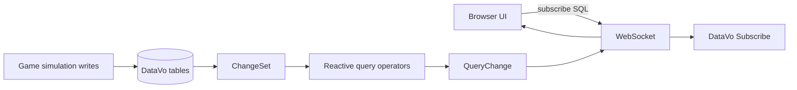

# LiveDeltaGateway.Demo

This is the "show, do not tell" demo: a browser UI connects to a WebSocket, sends SQL subscription
requests, and receives real `QueryChange` deltas from DataVo.

## Run

```bash
dotnet run --project demos/realtime-benchmarks/src/LiveDeltaGateway.Demo/LiveDeltaGateway.Demo.csproj
```

Open:

```text
http://localhost:5000
```

If ASP.NET chooses a different port, use the URL printed by `dotnet run`.

## WebSocket Protocol

Subscribe:

```json
{
  "type": "subscribe",
  "id": "team-alive",
  "sql": "SELECT Team, COUNT(*) AS Alive FROM Players WHERE Health > 0 GROUP BY Team"
}
```

Delta message:

```json
{
  "type": "change",
  "id": "team-alive",
  "tick": 42,
  "added": [],
  "removed": [],
  "updatedBefore": [],
  "updated": []
}
```

The server is not diffing snapshots. It uses:

```csharp
context.Subscribe(sql, change => websocket.Send(change));
context.DispatchPendingNotifications();
```

## Architecture



## Why This Is A Real Use Case

This is the exact architecture a game server, simulation tool, local-first app, or embedded ops
console wants:

- one embedded DB
- SQL-defined live views
- deltas over WebSocket
- no external CDC connector
- no Kafka/Flink service
- no client polling loop

## Limits

- This demo runs native ASP.NET Core, not inside WebAssembly.
- The repo already has `DataVo.Browser`, but reactive subscription exports are not exposed to JS yet.
  The browser/WASM README in this suite describes that next step.
