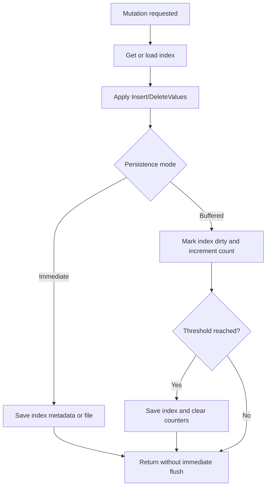

# IndexManager

`IndexManager` is the central coordinator for all active indexes in the process. It is responsible for creating index files, loading them lazily, caching loaded instances, routing mutations to the correct index implementation, and persisting changes back to disk.

## Responsibilities

- Build file paths and cache keys for indexes.
- Lazily load indexes from disk when first requested.
- Support multiple physical index engines behind a single API.
- Keep loaded indexes in memory for reuse.
- Persist mutations either immediately or in buffered batches.
- Drop single indexes or all indexes for an entire database.

## Supported Implementations

`IndexManager` can work with the following engines:

- `JsonBTreeIndex`
- `BinaryBTreeIndex`
- `BinaryBPlusTreeIndex`

If no explicit index type is provided during creation, the manager uses `DefaultIndexType`, which currently defaults to `BinaryBPlusTree`.

## Persistence Modes

`IndexManager` supports two persistence strategies:

| Mode | Behavior |
| :--- | :--- |
| `Immediate` | Every insert/delete mutation is written to disk right away. |
| `Buffered` | Mutations are tracked in memory and flushed once a configured threshold is reached, or when `FlushDirtyIndexes()` is called. |

## Mutation Lifecycle

## File Detection When Loading

When loading an index from disk, the manager determines which implementation to use from the file contents:

- If the file starts with `{`, it is treated as a JSON index and loaded with `JsonBTreeIndex.Load`.
- Otherwise, it is currently assumed to be a binary B+Tree file and loaded with `BinaryBPlusTreeIndex.LoadFile`.

This is a pragmatic compatibility mechanism used by the current implementation. The code comments note that a more complete production design would persist explicit index-type metadata.

## Side Effects

- Maintains an in-memory cache of index instances.
- May create, overwrite, or delete `*_index.btree` files on disk.
- Tracks dirty indexes and pending mutation counts when buffered persistence is enabled.
- Disposes cached index instances that implement `IDisposable` during database-wide cleanup.

## Main Operations

| Method | Purpose |
| :--- | :--- |
| `CreateIndex` | Creates a new index file and bulk-loads initial mappings. |
| `InsertIntoIndex` | Adds one logical key → row ID mapping. |
| `DeleteFromIndex` | Removes row IDs from all matching key buckets. |
| `FilterUsingIndex` | Resolves exact-match lookups and returns matching row IDs. |
| `IndexContainsKey` | Checks whether a key exists in the target index. |
| `IndexContainsRow` | Checks whether a row ID appears anywhere in the target index. |
| `DropIndex` | Removes a single index from cache and disk. |
| `DropDatabaseIndexes` | Removes all indexes for a database. |
| `FlushDirtyIndexes` | Forces all buffered dirty indexes to be written to disk. |
