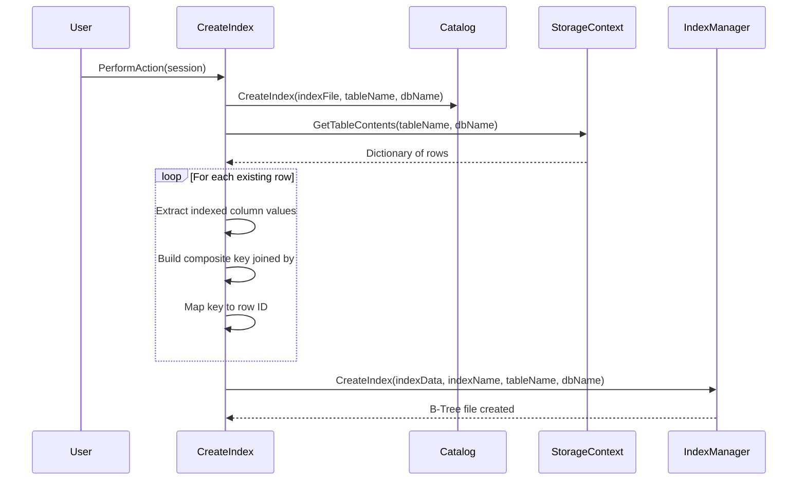

# CreateIndex

`CreateIndex` handles the `CREATE INDEX` DDL statement. It registers a new index in the system catalog and populates it with key-to-rowID mappings built from all existing rows in the target table.

## Overview

When a `CREATE INDEX` statement is executed, the following steps occur:

1. The active database is resolved from the session cache.
2. The index definition (name, target table, indexed columns) is registered in the system catalog via `Catalog.CreateIndex`.
3. All existing rows are read from the target table via `StorageContext.Instance.GetTableContents`.
4. For each row, the values of the indexed columns are extracted and concatenated into a composite key using `"##"` as a delimiter.
5. A dictionary mapping each composite key to its list of row IDs is built.
6. The B-Tree index file is created via `IndexManager.Instance.CreateIndex`.

## Composite Key Format

For a composite index on columns `LastName` and `FirstName`, a row with values `"Smith"` and `"John"` produces the key:

```
Smith##John
```

The trailing `"##"` delimiter is stripped after the last column value.

## Execution Flow



## Side Effects

- **Catalog**: A new index entry is added to the table's index list.
- **Disk**: A new B-Tree index file is created and populated.
- **Logging**: Success or error messages are logged and appended to `Messages`.

## Error Handling

All exceptions are caught internally. On failure:
- The error message is logged via `Logger.Error`.
- The error is appended to `Messages`.

Common failure causes:
- No database is currently selected.
- The specified table does not exist.
- An index with the same name already exists.

## Example

```sql
CREATE INDEX Idx_LastName ON Users (LastName);
```

This scans all rows in `Users`, extracts the `LastName` column value from each, and builds a B-Tree mapping those values to their row IDs.
