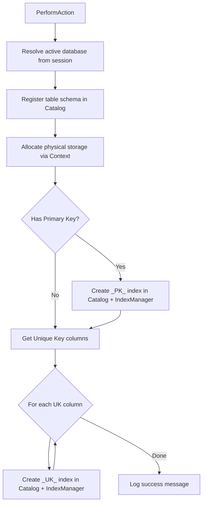

# CreateTable

`CreateTable` handles the `CREATE TABLE` DDL statement. It registers a new table in the system catalog, allocates physical storage, and automatically creates B-Tree indexes for primary key and unique key constraints.

## Overview

When a `CREATE TABLE` statement is executed, the following steps occur in order:

1. The active database is resolved from the session cache.
2. The table schema (columns, types, constraints) is registered in the system catalog via `Catalog.CreateTable`.
3. Physical storage is allocated via `Context.CreateTable`.
4. If the table defines primary key columns, a B-Tree index named `_PK_{TableName}` is created.
5. For each column with a `UNIQUE` constraint, a B-Tree index named `_UK_{ColumnName}` is created.

Since the table is newly created and contains no rows, all indexes are initialized empty.

## Execution Flow



## Side Effects

- **Catalog**: A new table entry is added to the database catalog.
- **Storage**: A new physical storage file is created for the table.
- **Indexes**: PK and UK B-Tree index files are created on disk (empty).
- **Logging**: Success or error messages are written to both the logger and `Messages`.

## Error Handling

All exceptions are caught internally. On failure:
- The error message is logged via `Logger.Error`.
- The error is appended to `Messages` prefixed with `"Error: "`.

Common failure causes:
- No database is currently selected (`"No database in use!"`).
- A table with the same name already exists.

## Example

```sql
CREATE TABLE Users (
    Id INT PRIMARY KEY,
    Email VARCHAR(255) UNIQUE,
    Name VARCHAR(100)
);
```

This creates:
- Table `Users` in the catalog and storage.
- Index `_PK_Users` on column `Id`.
- Index `_UK_Email` on column `Email`.
