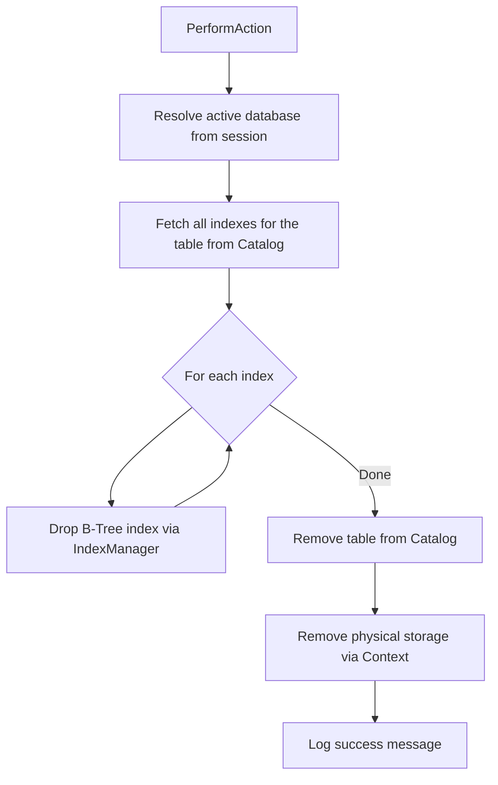

# DropTable

`DropTable` handles the `DROP TABLE` DDL statement. It removes a table and all of its associated indexes from the database.

## Overview

When a `DROP TABLE` statement is executed, the following steps occur:

1. The active database is resolved from the session cache.
2. All B-Tree indexes associated with the table are retrieved from the catalog and dropped via `IndexManager.Instance.DropIndex`.
3. The table definition is removed from the system catalog via `Catalog.DropTable`.
4. The physical storage files are removed via `Context.DropTable`.

Indexes are dropped **before** the table to prevent orphaned index files from remaining on disk.

## Execution Flow



## Side Effects

- **Indexes**: All B-Tree index files (PK, UK, and user-defined) associated with the table are deleted.
- **Catalog**: The table entry and its index entries are removed from the system catalog.
- **Storage**: The physical data file for the table is deleted.
- **Logging**: Success or error messages are logged and appended to `Messages`.

## Error Handling

All exceptions are caught internally. On failure:
- The error message is logged via `Logger.Error`.
- The error is appended to `Messages` prefixed with `"Error: "`.

Common failure causes:
- No database is currently selected (`"No database in use!"`).
- The specified table does not exist.

## Example

```sql
DROP TABLE Users;
```

This drops all indexes on `Users` (e.g., `_PK_Users`, `_UK_Email`, `Idx_LastName`), removes the catalog entry, and deletes the storage file.
