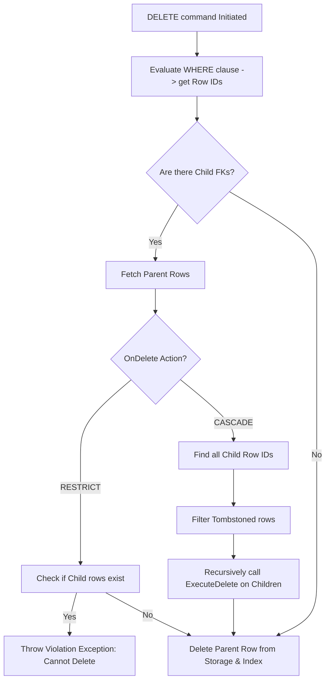

# DeleteFrom.cs

`DeleteFrom` executes `DELETE FROM <table> [WHERE <predicate>]` against the active database.

At a high level it:

- Evaluates the `WHERE` predicate to obtain candidate RowIds.
- Enforces MVCC and locking rules.
- Enforces child foreign-key constraints (`RESTRICT` / `CASCADE`).
- Deletes rows from the table storage and from all table indexes.

## Supported syntax

- `DELETE FROM <table>`
- `DELETE FROM <table> WHERE <expression>`

If the `WHERE` clause is omitted, it is treated as `WHERE true` (delete all rows).

## Transactional vs auto-commit

- **Transactional (`BEGIN TRANSACTION`)**
    - Validates each candidate RowId against the transaction snapshot (`MvccCoordinator.ValidateCanModifyRow`).
    - Buffers deletes in the transaction context (`BufferDelete`) instead of mutating storage immediately.

- **Auto-commit**
    - Acquires row write locks for candidate RowIds.
    - Re-evaluates the `WHERE` predicate after locking to avoid acting on stale candidates.
    - Applies deletes immediately and registers the MVCC delete version for the statement.

## Foreign key enforcement (child tables)

Before deleting parent rows, the action checks for dependent child rows:

- Attempts to use an FK index named `_FK_<ChildTable>_<ChildColumn>`.
- Falls back to a full scan of the child table when the FK index is missing.
- Filters out tombstoned/non-existent child rows before enforcing constraints.

`ON DELETE` actions:

- `RESTRICT`: throws when dependent rows exist.
- `CASCADE`: recursively deletes dependent rows.

### Cascade & tombstone flow

```mermaid
graph TD
    A[DELETE command Initiated] --> B[Evaluate WHERE clause -> get Row IDs]
    B --> C{Are there Child FKs?}
    
    C -- Yes --> D[Fetch Parent Rows]
    C -- No --> X[Delete Parent Row from Storage & Index]
    
    D --> E{OnDelete Action?}
    E -- RESTRICT --> F[Check if Child rows exist]
    F -- Yes --> G[Throw Violation Exception: Cannot Delete]
    F -- No --> X
    
    E -- CASCADE --> H[Find all Child Row IDs]
    H --> I[Filter Tombstoned rows]
    I --> J[Recursively call ExecuteDelete on Children]
    J --> X
```

## Notes

- Only `RESTRICT` and `CASCADE` are handled for delete cascades.
- Deletes also remove entries from every index returned by the catalog for the table.
