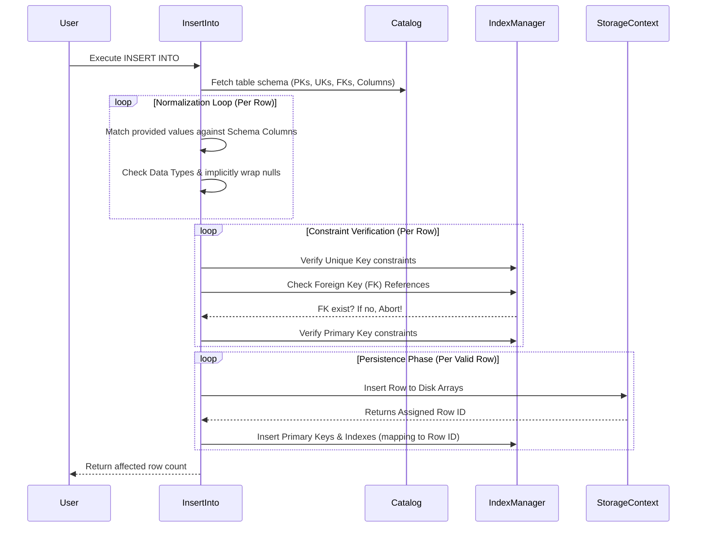

# InsertInto.cs

The `InsertInto.cs` action physically validates and writes new records executing the `INSERT INTO` SQL command. It maps literal arrays recursively capturing primary constraints, foreign constraints, and unique attributes to guarantee exact integrity dynamically allocating storage states seamlessly.

## Implementation Details & Methodologies

| Feature | Supported | Description |
| :--- | :---: | :--- |
| **Named Column Inserts** | Yes | Can handle `INSERT INTO table (col1) VALUES (val1)`. Unspecified columns gracefully default to `null`. |
| **Implicit Inserts** | Yes | Can handle `INSERT INTO table VALUES (val1, val2)` as long as the value count perfectly matches the total column count. |
| **Data Type Validation** | Yes | Checks literals verifying parameter structures match the schema (e.g. attempting to insert "text" into an Integer column throws safely). |
| **Primary Key Checking** | Yes | Traps `null` values natively analyzing `IndexManager` instances explicitly bouncing duplicates preventing IO overhead directly. |
| **Foreign Key Enforcement** | Yes | Looks up remote references executing indexed scans enforcing relational data boundaries continuously defining limits natively rejecting orphans elegantly. |
| **Batch Insertion** | No | Currently iterates raw values linearly, executing physical writes per row. Bulk sequential disk streaming is not presently supported. |

### Execution Flow Algorithm

The insertion algorithm executes as a serial constraint loop cleanly capturing values and isolating index configurations prior to touching disk arrays fluently predicting collisions robustly mapping boundaries securely.

### Critical Implementation specifics
- **Early Abort Policy:** If a single row violates a Unique/Foreign key, `invalidRow` captures the state flagging the transaction logging exact string indices. The entire row is skipped safely leaving the database integrity flawless, continuing with the next mapped row natively without crashing the session entirely.
- **Null Safety Allocation:** Missing columns inside `(col1, col2)` commands generate implicit `null` strings guaranteeing the dictionary structure aligns with the disk serialization arrays consistently manipulating sizes flawlessly dynamically tracking parameters.
