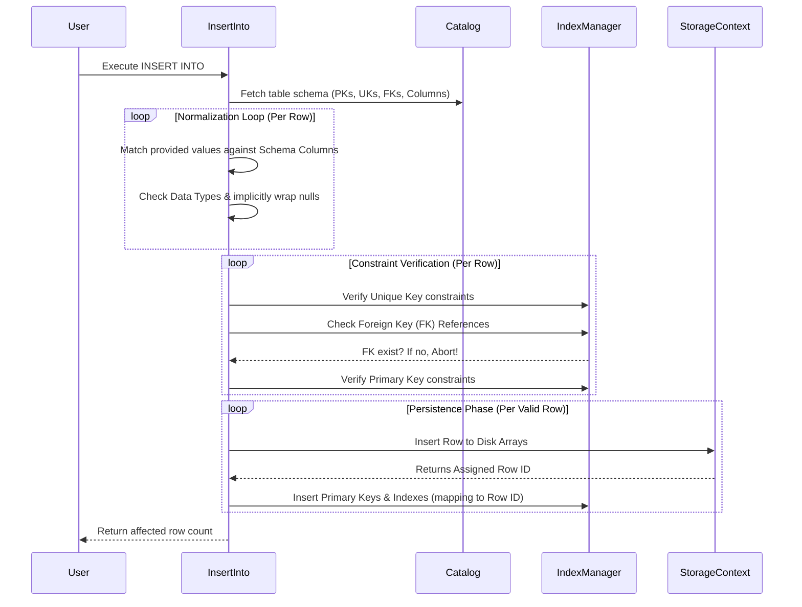

# InsertInto.cs

`InsertInto` executes `INSERT INTO` statements by validating each input row against the catalog schema and constraints, then writing accepted rows to storage and indexes.

## Supported syntax

- `INSERT INTO <table> VALUES (...)`
- `INSERT INTO <table> (<col1>, <col2>, ...) VALUES (...), (...), ...`

Multiple `VALUES` lists are supported; rows are processed sequentially.

## Validation and constraints

For each input row:

- Maps provided values onto the table schema. When a column list is provided, missing columns use the column default (or `NULL`).
- Performs type coercion via the catalog column parser (`Column.ParsedValue`).
- Enforces constraints:
    - Primary key: non-null and unique (uses `_PK_<Table>` index when available; otherwise table scan)
    - Unique keys: unique when non-null (uses `_UK_<Column>` index when available; otherwise table scan)
    - Foreign keys: referenced parent exists (uses the parent `_PK_<ParentTable>` index when available; otherwise table scan)

Rows that fail validation are skipped and a message is appended; other rows may still be inserted.

## Storage + indexing

- Auto-commit mode acquires a table write lock and inserts immediately.
- Transactional mode buffers inserts in the transaction context.
- After insertion, all indexes for the table are updated (including vector index types).

### Execution flow

```mermaid
sequenceDiagram
    participant User
    participant InsertInto
    participant Catalog
    participant IndexManager
    participant StorageContext

    User->>InsertInto: Execute INSERT INTO
    InsertInto->>Catalog: Fetch table schema (PKs, UKs, FKs, Columns)
    
    loop Normalization Loop (Per Row)
        InsertInto->>InsertInto: Match provided values against Schema Columns
        InsertInto->>InsertInto: Check Data Types & implicitly wrap nulls
    end
    
    loop Constraint Verification (Per Row)
        InsertInto->>IndexManager: Verify Unique Key constraints
        InsertInto->>IndexManager: Check Foreign Key (FK) References
        IndexManager-->>InsertInto: FK exist? If no, Abort!
        InsertInto->>IndexManager: Verify Primary Key constraints
    end
    
    loop Persistence Phase (Per Valid Row)
        InsertInto->>StorageContext: Insert Row to Disk Arrays
        StorageContext-->>InsertInto: Returns Assigned Row ID 
        InsertInto->>IndexManager: Insert Primary Keys & Indexes (mapping to Row ID)
    end
    
    InsertInto-->>User: Return affected row count
```

## Notes

- Inserts are sequential (no bulk I/O batching).
