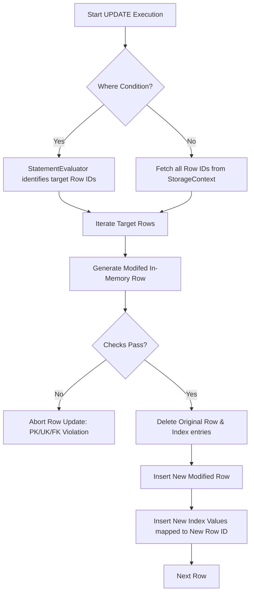

# Update.cs

`Update` executes `UPDATE <table> SET ... WHERE ...`.

It identifies matching RowIds, evaluates the `SET` expressions, validates constraints, and applies changes either by buffering (transactional mode) or by performing an out-of-place update (auto-commit).

## Supported syntax

- `UPDATE <table> SET <col> = <expr>[, ...] WHERE <predicate>`

## How it works

- The `WHERE` predicate is evaluated to choose candidate RowIds.
- `SET` expressions are evaluated per row using the existing row as input.
- Subquery expressions inside `SET` are materialized before evaluation.

### Constraints

Before applying changes, the update validates:

- Primary key and unique keys (including detecting duplicates generated within the same UPDATE batch)
- Foreign keys for updated FK columns
- Child FK safety: updating a referenced parent key is rejected when dependent child rows exist (no cascade-update)

### Transaction vs auto-commit

- **Transactional (`BEGIN TRANSACTION`)**
    - Validates MVCC permissions against the transaction snapshot.
    - Buffers updates (`BufferUpdate`) instead of mutating storage immediately.

- **Auto-commit**
    - Acquires row write locks and re-evaluates the predicate after locking.
    - Physically deletes the old row versions and inserts new ones, updating indexes.

### Out-of-place update diagram

```mermaid
flowchart TD
    A[Start UPDATE Execution] --> B{Where Condition?}
    B -- Yes --> C[StatementEvaluator identifies target Row IDs]
    B -- No --> D[Fetch all Row IDs from StorageContext]
    
    C --> E[Iterate Target Rows]
    D --> E
    
    E --> F[Generate Modifed In-Memory Row]
    
    F --> G{Checks Pass?}
    G -- No --> H[Abort Row Update: PK/UK/FK Violation]
    G -- Yes --> I[Delete Original Row & Index entries]
    
    I --> J[Insert New Modified Row]
    J --> K[Insert New Index Values mapped to New Row ID]
    
    K --> L[Next Row]
```

## Notes

- RowIds may change during an update because new rows are inserted and MVCC records the mapping from old -> new ids.
