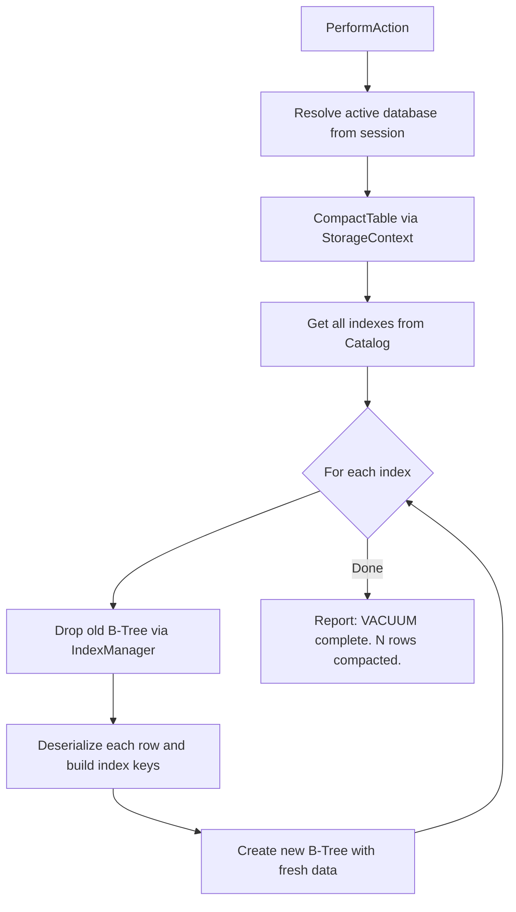

# Vacuum

`Vacuum` handles the `VACUUM` DML statement for a specific table. It performs storage compaction by removing tombstoned (soft-deleted) rows and rebuilding all associated indexes.

## Overview

When a `VACUUM` statement is executed, the following steps occur:

1. The active database is resolved from the session cache.
2. The storage engine compacts the table: tombstoned rows are removed and surviving rows are rewritten with new contiguous row IDs.
3. All indexes for the table are retrieved from the system catalog.
4. For each index:
   - The old B-Tree index file is dropped via `IndexManager.Instance.DropIndex`.
   - Each compacted row is deserialized using `RowSerializer.Deserialize`.
   - Index keys are rebuilt from the row data using `IndexKeyEncoder.BuildKeyString`.
   - A fresh B-Tree is created with the new row IDs via `IndexManager.Instance.CreateIndex`.

## Important Side Effects

- **Row IDs change**: After compaction, all row IDs are reassigned. Any external references to old row IDs become invalid.
- **All indexes are rebuilt**: PK, UK, and user-defined indexes are all dropped and recreated from scratch.
- **Storage file is rewritten**: The physical data file is replaced with a compacted version.
- **Logging**: A summary message with the compacted row count is appended to `Messages`.

## Execution Flow



## Error Handling

All exceptions are caught internally. On failure:
- The error message is logged via `Logger.Error`.
- The error is appended to `Messages`.

Common failure causes:
- No database is currently selected (`"No database in use!"`).
- The specified table does not exist.

## Example

```sql
VACUUM Users;
```

This removes all tombstoned rows from `Users`, rewrites the storage file, and rebuilds all indexes (`_PK_Users`, `_UK_Email`, etc.) with the new row IDs.
