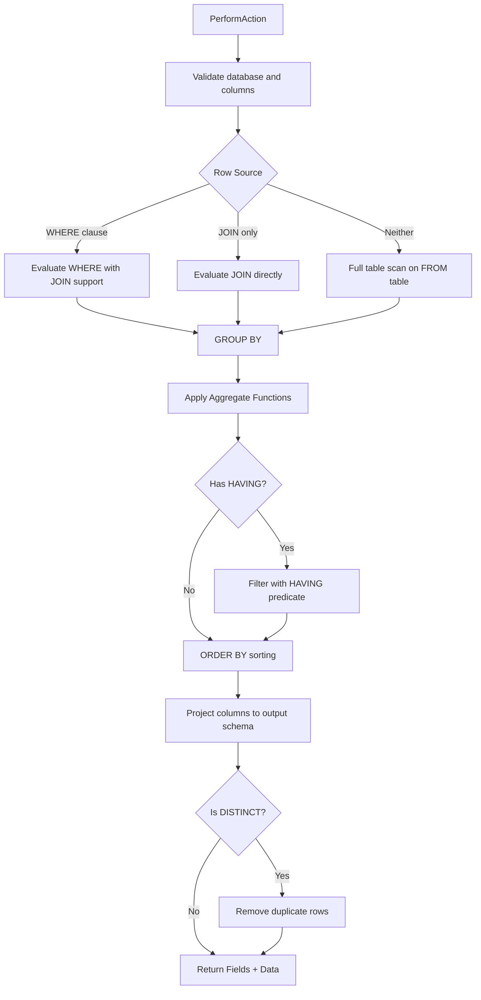

# Select

`Select` executes a SQL `SELECT` statement against the currently active database. It orchestrates the full query pipeline from table resolution through to final output projection.

## Overview

The `Select` action processes a query through the following pipeline stages:

1. **Validate** — resolves the active database and validates that all referenced columns exist.
2. **Evaluate Statements** — determines the row source (WHERE filter, JOIN, or full table scan).
3. **GROUP BY** — partitions the rows into groups if a GROUP BY clause is present.
4. **Aggregate** — applies aggregate functions (COUNT, SUM, AVG, etc.) to grouped data.
5. **HAVING** — filters grouped/aggregated rows based on the HAVING predicate.
6. **ORDER BY** — sorts the result set by one or more columns (ASC/DESC).
7. **Project** — maps the internal `JoinedRow` structures to output dictionaries keyed by field name.
8. **DISTINCT** — removes duplicate rows if `SELECT DISTINCT` was specified.

## Supported Features

| Feature | Description |
| :--- | :--- |
| **WHERE Filtering** | Delegates to `StatementEvaluator` (with JOIN) or the WHERE statement evaluator to filter rows using index lookups or full scans. |
| **JOIN** | Supports INNER, LEFT, RIGHT, CROSS, and FULL joins via the `Join` strategy class. |
| **GROUP BY** | Groups rows by one or more columns using `GroupByStatement.Evaluate`. |
| **Aggregations** | Applies aggregate functions (COUNT, SUM, AVG, MIN, MAX) via `AggregateStatement.Perform`. |
| **HAVING** | Filters grouped results by recursively evaluating the HAVING expression tree against each row. Supports nested AND/OR conditions. |
| **ORDER BY** | Multi-column sorting with ASC/DESC per column. Uses `DynamicObjectComparer` for type-aware ordering. |
| **DISTINCT** | De-duplicates result rows using structural equality via `DictionaryComparer`. |

## Execution Flow



## Key Implementation Details

- **`EvaluateStatements`**: Chooses between three strategies based on the query clauses present. When both WHERE and JOIN exist, the WHERE evaluator handles JOIN integration internally.
- **`ApplyOrderToColumn`**: Supports multi-column ORDER BY by chaining `OrderBy`/`ThenBy` calls. The first column uses `OrderBy`; subsequent columns use `ThenBy`.
- **`EvaluatePredicate`**: Recursively evaluates HAVING expressions. Supports AND/OR logical operators and all comparison operators (`=`, `!=`, `<`, `>`, `<=`, `>=`).
- **`ResolveColumnValue`**: Resolves column values from `JoinedRow` structures, supporting both qualified (`Table.Column`) and unqualified (`Column`) references. Throws if an unqualified reference is ambiguous across multiple tables.
- **`CreateFieldsFromColumns`**: In a JOIN context, field names are prefixed with the table name or alias. Aggregation result columns (stored under `GroupBy.HASH_VALUE`) are appended at the end.

## Error Handling

All exceptions are caught internally. On failure:
- The full exception (including stack trace) is logged and appended to `Messages`.

Common failure causes:
- No database is currently selected (`"No database in use!"`).
- Invalid or ambiguous column references.
- Unsupported HAVING predicate node types.

## Example

```sql
SELECT u.Name, COUNT(*) AS OrderCount
FROM Users u
INNER JOIN Orders o ON u.Id = o.UserId
WHERE u.Active = 1
GROUP BY u.Name
HAVING COUNT(*) > 5
ORDER BY OrderCount DESC;
```

This query:
1. Joins `Users` and `Orders` on `Id = UserId`.
2. Filters to active users only.
3. Groups by user name.
4. Counts orders per user and filters groups with more than 5.
5. Sorts by order count descending.
