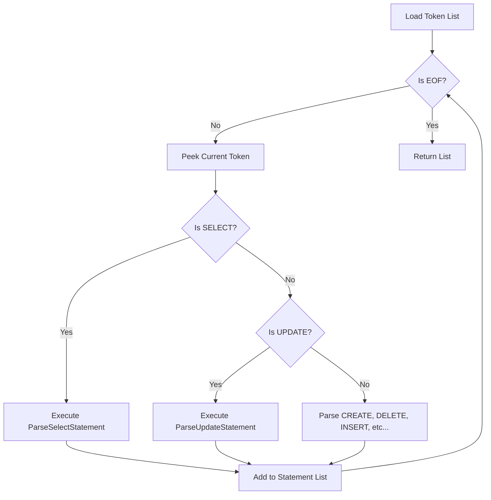

# Parser.cs

`Parser` converts lexer `Token` sequences into typed `SqlStatement` AST nodes.

It uses a recursive-descent top-level dispatcher and an operator-precedence (shunting-yard style) expression parser for `WHERE`/projection expressions.

## Key capabilities

| Feature | Supported | Notes |
| :--- | :---: | :--- |
| Recursive-descent statement parsing | Yes | Dispatches based on the leading keyword (SELECT/INSERT/UPDATE/DELETE/CREATE/...). |
| Expressions | Yes | Boolean logic, comparisons, arithmetic, functions, and parentheses. |
| Subqueries in expressions | Yes | `IN (SELECT ...)`, `EXISTS (SELECT ...)`, and scalar subqueries `(SELECT ...)` inside expression contexts. |
| Parenthesized SELECT at top-level | No | `(SELECT ...)` / parenthesized compound statements are rejected by the top-level loop. |
| Window functions | Partial | Special-cases `RANK() OVER (...)` in SELECT projections. |

### Top-Level Dispatch Algorithm

```mermaid
flowchart TD
    Start[Load Token List] --> Loop{Is EOF?}
    Loop -- No --> Peek[Peek Current Token]
    
    Peek --> IsSelect{Is SELECT?}
    IsSelect -- Yes --> ParseSelect[Execute ParseSelectStatement]
    ParseSelect --> Push[Add to Statement List]
    Push --> Loop
    
    IsSelect -- No --> IsUpdate{Is UPDATE?}
    IsUpdate -- Yes --> ParseUpdate[Execute ParseUpdateStatement]
    ParseUpdate --> Push
    
    IsUpdate -- No --> OtherStatements[Parse CREATE, DELETE, INSERT, etc...]
    OtherStatements --> Push
    
    Loop -- Yes --> Exit[Return List<SqlStatement>]
```

## Notes

- Expression parsing normalizes token streams to drop dangling `AND`/`OR` operators when an operand is missing.
- Subqueries are parsed by collecting tokens until the matching `)` and parsing the inner token stream with a new `Parser` instance.
