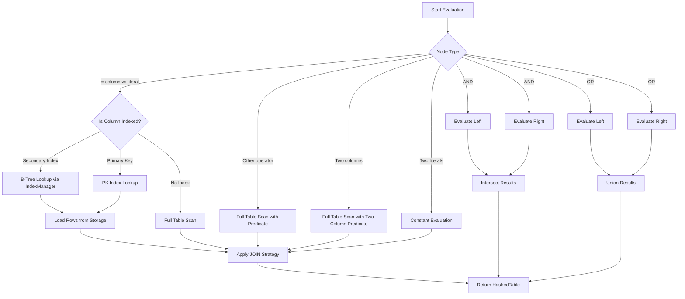

# StatementEvaluator

`StatementEvaluator` evaluates WHERE clause expressions against table records in the context of a JOIN operation. It inherits from `ExpressionEvaluatorCore<HashedTable>` and returns fully joined result sets as `HashedTable` instances.

## Overview

The evaluator selects the most efficient access path for each leaf condition in the WHERE expression tree:

1. **Secondary index lookup** — when the column has a B-Tree index defined.
2. **Primary key index lookup** — when the column is part of the table's primary key.
3. **Full table scan** — as a fallback when no index covers the column.

After filtering rows from the base table, all results are automatically passed through the configured `Join` strategy (INNER, LEFT, CROSS, etc.) to produce the final joined output.

## Supported Features

| Feature | Description |
| :--- | :--- |
| **Index-Accelerated Equality** | Equality conditions (`=`) are routed through `IndexManager.FilterUsingIndex` for O(log n) B-Tree lookups, avoiding full scans when possible. |
| **Non-Equality Operators** | Operators like `>`, `<`, `!=`, `>=`, `<=`, `IS NULL`, and `IS NOT NULL` trigger a full table scan with a per-row predicate. |
| **Two-Column Comparisons** | Supports expressions like `col_a = col_b` within the same table. Cross-table column comparisons in the WHERE clause throw an exception. |
| **Constant Expressions** | Literal-to-literal comparisons (e.g., `5 > 3`) return either all rows or an empty set. |
| **Boolean Algebra (AND / OR)** | Handled by the base class — `AND` intersects result set keys; `OR` computes their union. |
| **Null Handling** | `IS NULL` and `IS NOT NULL` are supported as first-class operators in predicates. |

## Evaluation Flow

## Key Implementation Details

- **`HandleIndexableStatement`**: For equality conditions, checks the table's `IndexedColumns` dictionary first, then the `PrimaryKeys` list, falling back to a linear scan. String values are trimmed of surrounding single quotes before comparison.
- **`And` / `Or`**: `AND` performs a dictionary key intersection; `OR` computes a union, preferring entries from the left result when duplicates exist.
- **`GetJoinedTableContent`**: Every filtering method funnels results through this helper, which wraps rows in `JoinedRow` / `JoinedRowId` structures and delegates to `Join.Evaluate` for cross-table combination.
- **`EvaluateEquality` / `CompareDynamics`**: Use `ExpressionValueComparer` for type-aware comparison with quoted-string trimming. Return `false` / `null` when either operand is `null`.

## Exceptions

| Exception | Condition |
| :--- | :--- |
| `SecurityException` | An unrecognized operator is passed to `DeterminePredicate` or `DetermineTwoColumnPredicate`. |
| `SecurityException` | A two-column expression references columns from different tables. |

## See Also

- [`StatementEvaluatorWOJoin`](./index.md) — single-table evaluator variant (no JOIN).
- [`ExpressionEvaluatorCore<T>`](./index.md) — the abstract base class for recursive expression evaluation.
