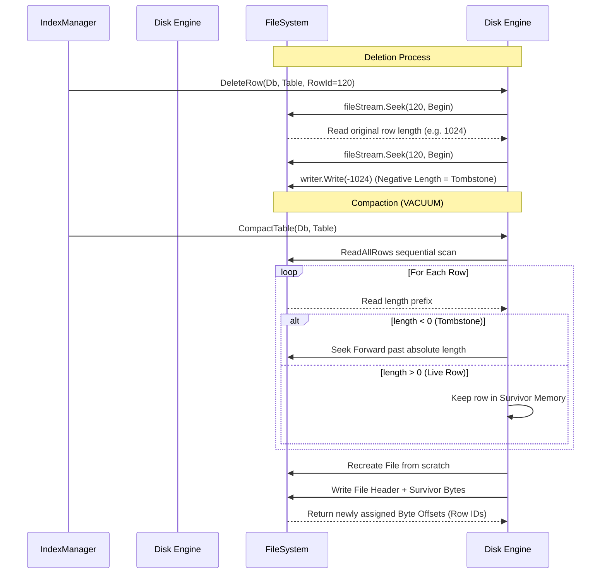

# DiskStorageEngine.cs

`DiskStorageEngine` is an `IStorageEngine` implementation that stores table rows in `.dat` files under the configured storage directory.

## File format

- 8-byte header: magic `"DaVo"` (4 bytes) + version (int32).
- Each row is stored as: `[int32 length][payload bytes...]`.
- The returned RowId is the byte offset where the row's length prefix begins.
    - Because of the header, the first valid RowId is at offset `8`.
    - RowId `0` is reserved as the B+Tree empty-slot sentinel.

## Deletion (tombstones)

Rows are deleted by negating the stored length prefix:

- Live row: `length > 0`
- Tombstoned row: `length < 0` and `-length` indicates how many bytes to skip during scans

## Compaction (VACUUM)

`CompactTable` rewrites the file without tombstoned rows and returns the new RowIds for each survivor. Indexes must be rebuilt/remapped using the returned mapping.

```mermaid
sequenceDiagram
    participant IndexManager
    participant DiskStorageEngine as Disk Engine
    participant FileSystem
    
    Note over Disk Engine, FileSystem: Deletion Process
    IndexManager->>Disk Engine: DeleteRow(Db, Table, RowId=120)
    Disk Engine->>FileSystem: fileStream.Seek(120, Begin)
    FileSystem-->>Disk Engine: Read original row length (e.g. 1024)
    Disk Engine->>FileSystem: fileStream.Seek(120, Begin)
    Disk Engine->>FileSystem: writer.Write(-1024) (Negative Length = Tombstone)
    
    Note over Disk Engine, FileSystem: Compaction (VACUUM)
    IndexManager->>Disk Engine: CompactTable(Db, Table)
    Disk Engine->>FileSystem: ReadAllRows sequential scan
    loop For Each Row
        FileSystem-->>Disk Engine: Read length prefix
        alt length < 0 (Tombstone)
            Disk Engine->>FileSystem: Seek Forward past absolute length
        else length > 0 (Live Row)
            Disk Engine->>Disk Engine: Keep row in Survivor Memory
        end
    end
    Disk Engine->>FileSystem: Recreate File from scratch
    Disk Engine->>FileSystem: Write File Header + Survivor Bytes
    FileSystem-->>Disk Engine: Return newly assigned Byte Offsets (Row IDs)
```

## Concurrency

Per-table file access is serialized using a process-wide lock map keyed by the normalized file path.
