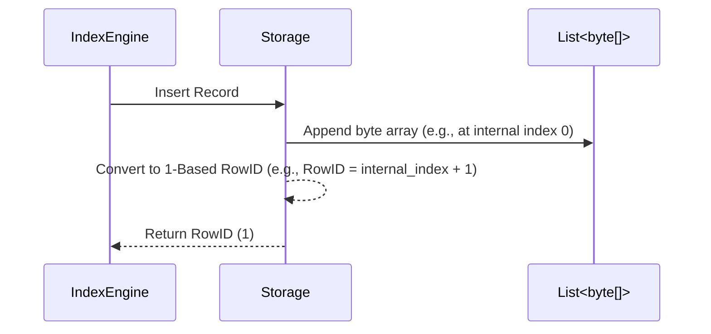

# InMemoryStorageEngine

The `InMemoryStorageEngine.cs` provides a high-performance, volatile storage backend utilizing RAM directly. It relies on thread-safe data structures (`ConcurrentDictionary`) to track and store collections of byte arrays, mirroring the behavior of physical disk storage but prioritizing speed over persistence.

## Implementation Details & Methodologies

| Feature | Supported | Description |
| :--- | :---: | :--- |
| **Volatile Concurrent Tracking** | Yes | Maintains a thread-safe `ConcurrentDictionary<string, List<byte[]>>` to manage database tables in memory without disk I/O bottlenecks. |
| **Sequential Offset Assignment** | Yes | Automatically calculates and assigns 1-based offsets (RowIDs) as organic addresses for newly inserted records. |
| **Memory Safe Referencing** | Yes | Uses direct index array access (`table[index]`) rather than file stream operations, resulting in immediate `O(1)` data retrieval. |

### Index Alignment & Tombstone Approach

Because the `IndexManager` and B+Tree data layouts use `0` to denote null or unassigned pointers, row identifiers must be strictly positive.

**1-Based Row Identifiers:**
`InMemoryStorageEngine` forces all output assignments to start from `1`.

### Critical Implementation Specifics
- **Null Array Tombstoning:** Similar to `DiskStorageEngine`, physical deletion does not shift the underlying array layout (which would invalidate surviving RowIDs). Instead, deleting a row explicitly sets the array element to `null` (`table[index] = null!`).
- **Vacuum Compaction Rewrite:** The compaction process safely iterates the existing array, skipping `null` gaps, and writes the surviving records into a fresh, contiguous array state.
