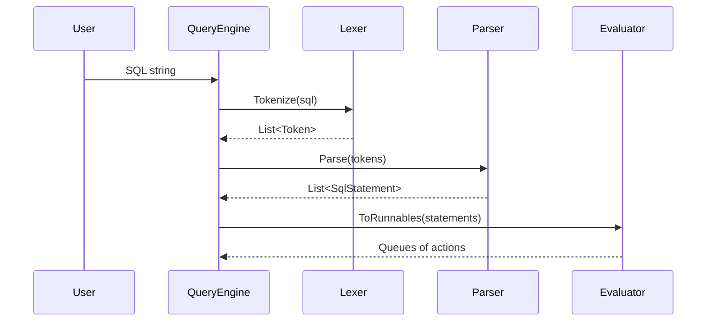
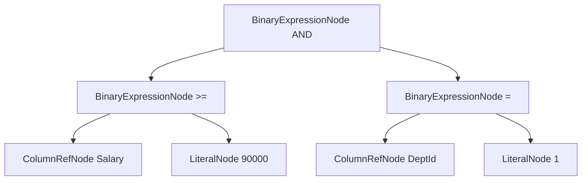
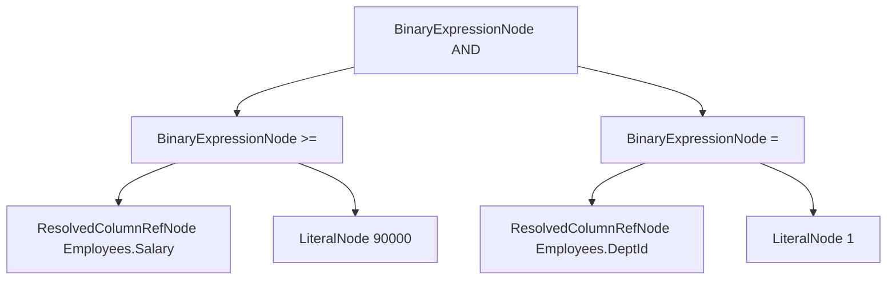

# AST Build Sequence (Detailed)

## Query to AST

## Expression AST shape

For a query like:

`SELECT * FROM Employees WHERE Salary >= 90000 AND DeptId = 1`

Typical expression tree:

## Bound expression tree

After binder pass, unresolved column refs are replaced by resolved refs:

## Notes

- Parser should not access catalog/table metadata.
- Binder performs semantic resolution.
- Evaluator should execute against resolved expressions.
