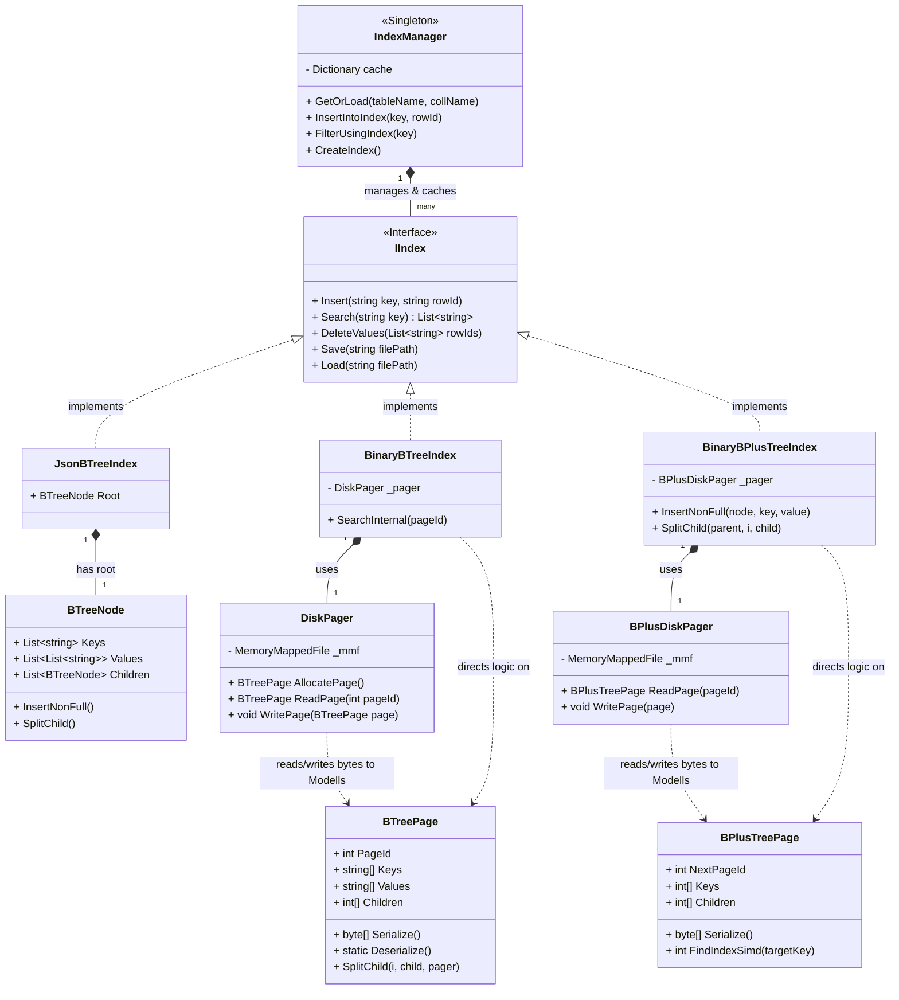

```mermaid
classDiagram
    %% Core Management Layer
    class IndexManager {
        <<Singleton>>
        - Dictionary cache
        + GetOrLoad(tableName, collName)
        + InsertIntoIndex(key, rowId)
        + FilterUsingIndex(key)
        + CreateIndex()
    }

    class IIndex {
        <<Interface>>
        + Insert(string key, string rowId)
        + Search(string key) List~string~
        + DeleteValues(List~string~ rowIds)
        + Save(string filePath)
        + Load(string filePath)
    }

    %% Legacy JSON B-Tree (Memory Only)
    class JsonBTreeIndex {
        + BTreeNode Root
    }
    class BTreeNode {
        + List~string~ Keys
        + List~List~string~~ Values
        + List~BTreeNode~ Children
        + InsertNonFull()
        + SplitChild()
    }

    %% Binary B-Tree Engine (Disk Paging)
    class BinaryBTreeIndex {
        - DiskPager _pager
        + SearchInternal(pageId)
    }
    class DiskPager {
        - MemoryMappedFile _mmf
        + BTreePage AllocatePage()
        + BTreePage ReadPage(int pageId)
        + void WritePage(BTreePage page)
    }
    class BTreePage {
        + int PageId
        + string[] Keys
        + string[] Values
        + int[] Children
        + byte[] Serialize()
        + static Deserialize()
        + SplitChild(i, child, pager)
    }

    %% Modern Binary B+Tree Engine (SIMD & Sequential Paging)
    class BinaryBPlusTreeIndex {
        - BPlusDiskPager _pager
        + InsertNonFull(node, key, value)
        + SplitChild(parent, i, child)
    }
    class BPlusDiskPager {
        - MemoryMappedFile _mmf
        + BPlusTreePage ReadPage(pageId)
        + void WritePage(page)
    }
    class BPlusTreePage {
        + int NextPageId
        + int[] Keys
        + int[] Children
        + byte[] Serialize()
        + int FindIndexSimd(targetKey)
    }

    %% Relationships
    IndexManager "1" *-- "many" IIndex : manages & caches
    IIndex <|.. JsonBTreeIndex : implements
    IIndex <|.. BinaryBTreeIndex : implements
    IIndex <|.. BinaryBPlusTreeIndex : implements

    JsonBTreeIndex "1" *-- "1" BTreeNode : has root

    BinaryBTreeIndex "1" *-- "1" DiskPager : uses
    DiskPager ..> BTreePage : reads/writes bytes to Modells
    BinaryBTreeIndex ..> BTreePage : directs logic on

    BinaryBPlusTreeIndex "1" *-- "1" BPlusDiskPager : uses
    BPlusDiskPager ..> BPlusTreePage : reads/writes bytes to Modells
    BinaryBPlusTreeIndex ..> BPlusTreePage : directs logic on
```