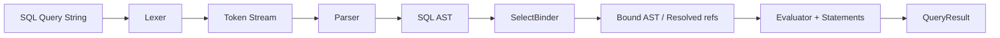

# SQL Pipeline and Component Map (AST-first)

This document explains how a SQL string moves through the system, what each core component does, and which leftovers are still candidates for migration/cleanup.

## 1) End-to-end flow

## 2) Core roles

- `Lexer`:
  - Splits SQL text into tokens (`Keyword`, `Identifier`, literals, operators, punctuation).
  - Handles comment stripping and keyword normalization.
- `Parser`:
  - Builds AST nodes (`SelectStatement`, `JoinDetailNode`, `ExpressionNode`, etc.).
  - Builds expression trees for `WHERE` / `HAVING`.
- `SelectBinder`:
  - Resolves table aliases and column references.
  - Converts unresolved references (`ColumnRefNode`) into resolved references (`ResolvedColumnRefNode`).
  - Detects semantic errors early (unknown alias/table, unknown column, ambiguous column).
- `SelectModel`:
  - Wires bound objects into statement executors (`Where`, `Join`, `GroupBy`, `Aggregate`).
  - Prepares selected column projection metadata.
- `Select`:
  - Executes the query pipeline in order:
    1. source rows / join rows
    2. where filtering
    3. grouping
    4. aggregation
    5. having filtering
    6. ordering
    7. projection to output fields/data
- `StatementEvaluator` + `StatementEvaluatorWOJoin`:
  - Evaluate expression trees over rows.
  - `WOJoin` works on a single table id set; `StatementEvaluator` returns joined row maps.

## 3) Why there are two WHERE evaluators

Today they are still both used:

- `StatementEvaluatorWOJoin` is optimized for single-table filtering (e.g., delete/where id set).
- `StatementEvaluator` operates over joined row structures and supports join-aware filtering.

This split is historical but still functional. It can be unified later behind one evaluator API with strategy mode.

## 4) Select.cs vs SelectModel.cs vs SelectBinder.cs

- `SelectBinder.cs`: **semantic binding layer** (name resolution and validation).
- `SelectModel.cs`: **composition layer** (bind + construct executable statement objects).
- `Select.cs`: **execution orchestration** (actual runtime pipeline + output shaping).

This 3-layer structure is valid if boundaries remain strict:

- binder = no execution,
- model = no heavy row iteration,
- select = runtime execution only.

## 5) Current leftovers / migration candidates

### A) WHERE evaluator duplication

- Candidate: unify `StatementEvaluator` and `StatementEvaluatorWOJoin` with one internal engine and two adapters.

### B) Typed exceptions

- There are still generic `Exception` throws in execution paths.
- Candidate: introduce `EvaluationException`, `ExecutionPlanException` and replace broad throws in evaluators/statements.

### C) Alias/column formatting spread

- Projection formatting and alias handling still appears in multiple places.
- Candidate: centralize projection formatting into one helper service.

## 6) Suggested next migration order

1. Introduce typed evaluator exceptions and replace generic throws in evaluators.
2. Add a unified expression evaluation core used by both current evaluator classes.
3. Keep both public classes temporarily as wrappers.
4. Remove duplicated comparison/equality helpers from split evaluators.
5. Add focused tests for:
   - ambiguous where columns
   - unknown alias
   - mixed join + where + having + order by

## 7) Validation checklist for future refactors

- Build must succeed.
- Full tests must pass.
- No `Match` constructors reintroduced in DQL/DDL/DML AST path.
- No string parser fallback in SELECT path.
- Binder must resolve all column refs before execution.
