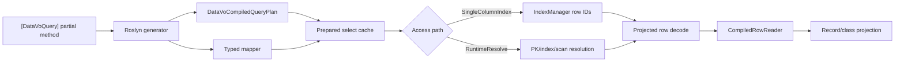
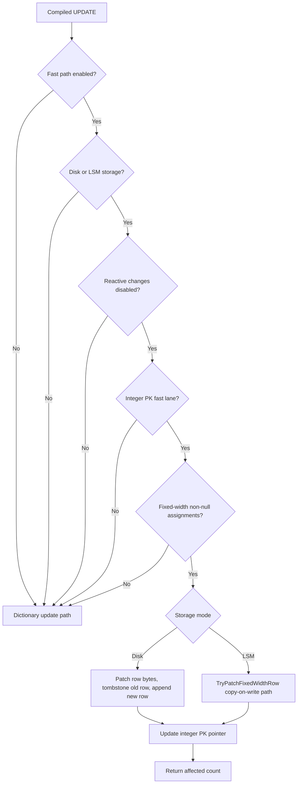
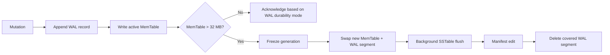

# Fast Paths

DataVo has several short paths that bypass general-purpose SQL execution when the query shape, storage mode, and schema allow it. They are not separate APIs users must call in most cases; they are execution routes selected by source-generated plans, compiled query runtime helpers, vector predicate planning, or LSM storage internals.

The key principle is fail-safe optimization. A fast path must return the same result as the normal path or decline and fall back.

## Source-Generated Select Path



The generator emits a static `DataVoCompiledQueryPlan` and, when possible, a typed mapper over `CompiledRowReader`. Runtime execution caches prepared select handles in a `ConditionalWeakTable<DataVoContext, ...>` so projection metadata and resolved access paths are not rebuilt for every call.

The indexed hit path can avoid:

| Avoided work | How |
| --- | --- |
| SQL re-parsing | The generator emits a static plan. |
| Rebuilding projection metadata | Prepared select handles cache projection state per context. |
| Dictionary materialization | Typed mappers read through `CompiledRowReader`. |
| Boxing primitive cells | Reader methods return typed values such as `int`, `long`, `DateOnly`, and `Guid`. |
| Decoding unprojected columns | The storage path can decode only projected cells from row bytes. |

## Compiled Access Paths

`CompiledAccessPath` describes how a compiled query should locate rows.

| Value | Current status | Meaning |
| --- | --- | --- |
| `RuntimeResolve` | Default | Resolve the path at runtime: primary key, secondary index, or scan. |
| `PrimaryKey` | Reserved | Not emitted by the current generator. |
| `SingleColumnIndex` | Emitted with a schema manifest | Use the named single-column index resolved at compile time. |

A pre-resolved access path is a bet about runtime state. If the named index is missing or the table schema no longer matches, the compiled query must degrade to runtime resolution.

## Fixed-Width Update Fast Path

The compiled update fast path targets a very specific shape: fixed-width single-row updates found through an integer primary-key fast lane.



The controlling switch is:

```csharp
new DataVoConfig
{
    EnableZeroAllocCompiledUpdate = true
};
```

For disk mode, the fast path byte-patches fixed-width cells in the serialized row, tombstones the old row, appends the patched bytes as the new row, and repoints the integer primary-key fast lane. If binary WAL commit through group commit is enabled, it emits a binary update frame.

For LSM mode, the path delegates to `TryPatchFixedWidthRow` or batched `TryPatchFixedWidthRows`, preserving the LSM copy-on-write model and WAL durability ticket behavior.

Fallback is normal and expected. Null assignments, variable-width columns, missing fast-lane indexes, active reactive change capture, unsupported storage modes, or mismatched schemas all route back to the general update implementation.

## LSM Write Path



The active MemTable is an arena-backed skiplist. Keys, values, node headers, and forward pointers are carved from pooled slabs through `Arena`, which is why the LSM write path can keep steady-state managed allocation low.

The 32 MB flush threshold is internal today:

```csharp
internal long FlushThresholdBytes { get; set; } = 32L << 20;
```

Routine flush I/O happens on the background pipeline. Writers only block for backpressure when too many frozen generations are already queued.

## WAL Durability Tickets

In strict LSM mode, `PutDeferDurability` and related calls return an `LsmWalDurabilityTicket`. The mutation is appended and placed into the MemTable while the caller can wait for durability outside higher-level locks. That design allows concurrent strict-mode writers to share a group-commit fsync instead of forcing every writer to serialize on its own disk flush.

Relaxed mode skips the synchronous stable-storage wait and acknowledges after appending into the OS-buffered path. That is why relaxed mode dominates throughput charts, and why it has a different power-loss durability contract.

## Vector Predicate Fast Path

Vector SQL can use indexes and hybrid predicate routing when the planner judges that an ANN prefilter is likely to reduce work.

The planner considers:

| Setting | Role |
| --- | --- |
| `EnableVectorPredicateFastPath` | Master switch. |
| `VectorPredicateFastPathMinRows` | Avoids fast path on tiny tables. |
| `VectorPredicateFastPathMaxTopKRatio` | Rejects candidates that are too large a fraction of the table. |
| `VectorPredicateFastPathCandidateMultiplier` | Expands estimated qualifying rows into ANN candidate count. |
| `VectorPredicateFastPathMaxExpansionPasses` | Allows more candidates when `LIMIT` and post-filtering return too few rows. |

Vector fast paths are cost-sensitive. A flat SIMD path can be better than HNSW for small-to-medium vector counts where graph build cost dominates total benchmark time.

## Practical Guidance

Use the normal SQL and `DataVoContext` APIs first. Reach for source-generated queries and fast-path measurement only after a workload has stable hot spots. When benchmarking, always record the storage mode, durability setting, indexes, data shape, and whether source-generated compiled queries are in use.
