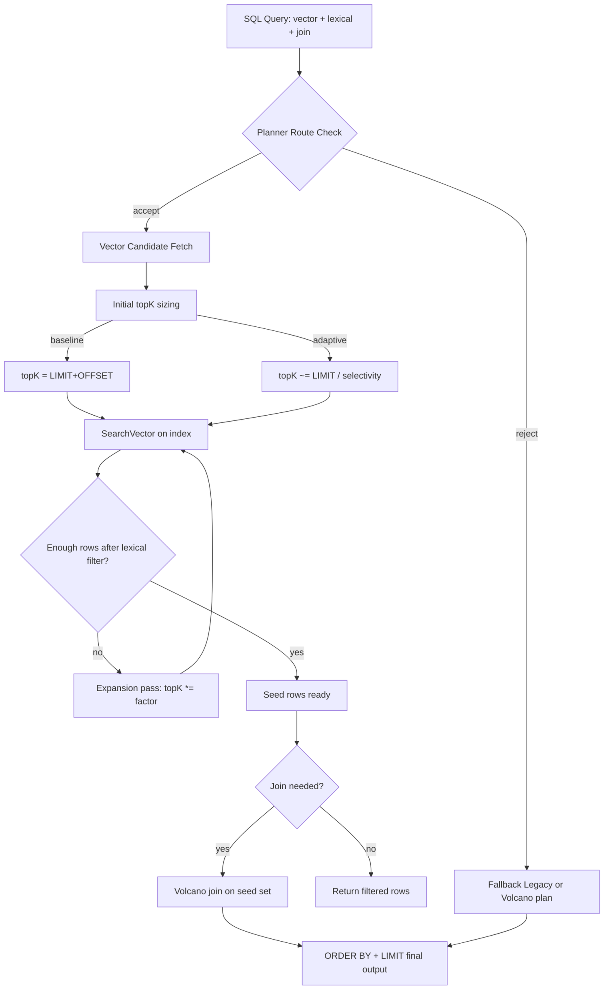
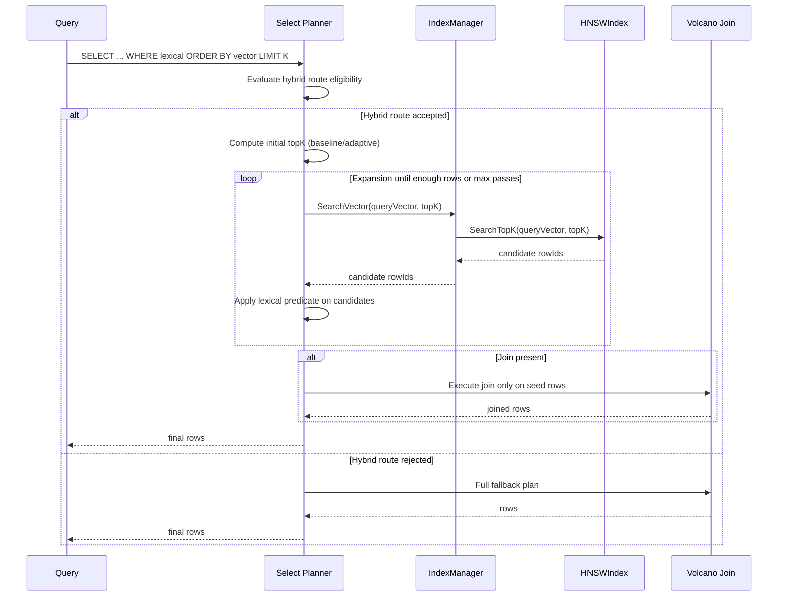

# HNSW + Hybrid Planner: Current State and What Happens Internally

> Last updated: 2026-03-24
> Audience: implementation and architecture tracking
> Status: Active implementation (hybrid planner optimization in progress)

## Why this document exists

This file answers the practical question:

- What is already implemented?
- What is still a roadmap item?
- What exactly happens when a mixed query (vector + lexical + join) runs?

## Quick reality check

At this moment, the optimizer/planner side is significantly advanced, while the index core is in transition.

- Implemented now:
  - Hybrid route selection (accept/reject buckets)
  - Candidate-first execution for vector queries
  - Adaptive topK sizing and expansion passes
  - Per-query and periodic telemetry snapshots
- Not fully implemented yet:
  - Production-grade, full HNSW graph behavior with complete ANN controls and tuning parity

## End-to-end execution flow



## Sequence of a mixed query



## Example 1: ORDER BY vector + lexical filter

SQL:

```sql
SELECT Id, Emb <=> '[1,0,0]' AS rank
FROM Embeddings
WHERE Status = 'active'
ORDER BY rank ASC
LIMIT 5;
```

Internal behavior (accepted hybrid route):

1. Planner checks route eligibility.
2. Computes initial topK:
   - Baseline mode: topK = 5
   - Adaptive mode: topK is inflated from selectivity estimate (for example 50).
3. Performs vector candidate fetch.
4. Applies lexical predicate on candidates.
5. If filtered rows < 5, expansion pass increases topK and retries.
6. Returns final rows.

## Example 2: Mixed query with join

SQL:

```sql
SELECT p.Id, p.Name, e.Emb <=> '[0.95,0.05,0]' AS rank
FROM Embeddings e
JOIN Products p ON p.Id = e.ProductId
WHERE e.Status = 'active'
ORDER BY rank ASC
LIMIT 3;
```

Internal behavior:

1. Candidate row IDs are fetched from vector path first.
2. Embedding-table lexical filter is applied on seed rows.
3. Volcano join executes on this reduced seed set.
4. Final ordering/limit is applied.

This is the key optimization: do not join full source tables when a smaller candidate set can be safely produced first.

## Telemetry that now exists

Per-query telemetry (when enabled):

- route decision
- requested topK and initial topK
- selectivity estimate
- expansion pass count
- query elapsed time and result rows

Periodic snapshot telemetry (query-interval based):

- total processed queries
- number of hybrid-used queries
- average expansion passes
- top reason bucket counters

Typical bucket names:

- `hybrid.orderby.accept`
- `hybrid.orderby.reject.topk_ge_total_rows`
- `hybrid.orderby.reject.complexity_gate`
- `hybrid.orderby.initial_topk.baseline`
- `hybrid.orderby.initial_topk.adaptive`

## What benchmark-backed test shows

A representative mixed workload test was added.

Observed in test snapshots:

- Baseline initial topK: avg expansion passes about 7.0
- Adaptive initial topK: avg expansion passes about 4.0

Interpretation: adaptive initial topK reduced expansion retries by about 42.9% on that workload shape.

## Phase status (high-level)

- Phase 5 (telemetry + expansion tuning): nearly complete
- Phase 6 (hybrid planner optimization): in progress
- Next major index-core step: continue HNSW internals toward richer ANN graph behavior

## Practical takeaway

Today, the biggest wins are from planner-level intelligence:

- reduce scanned/joined rows early
- adapt candidate sizes
- observe behavior with telemetry

Index-core ANN sophistication is the next continuation track, while keeping current behavior stable and measurable.
