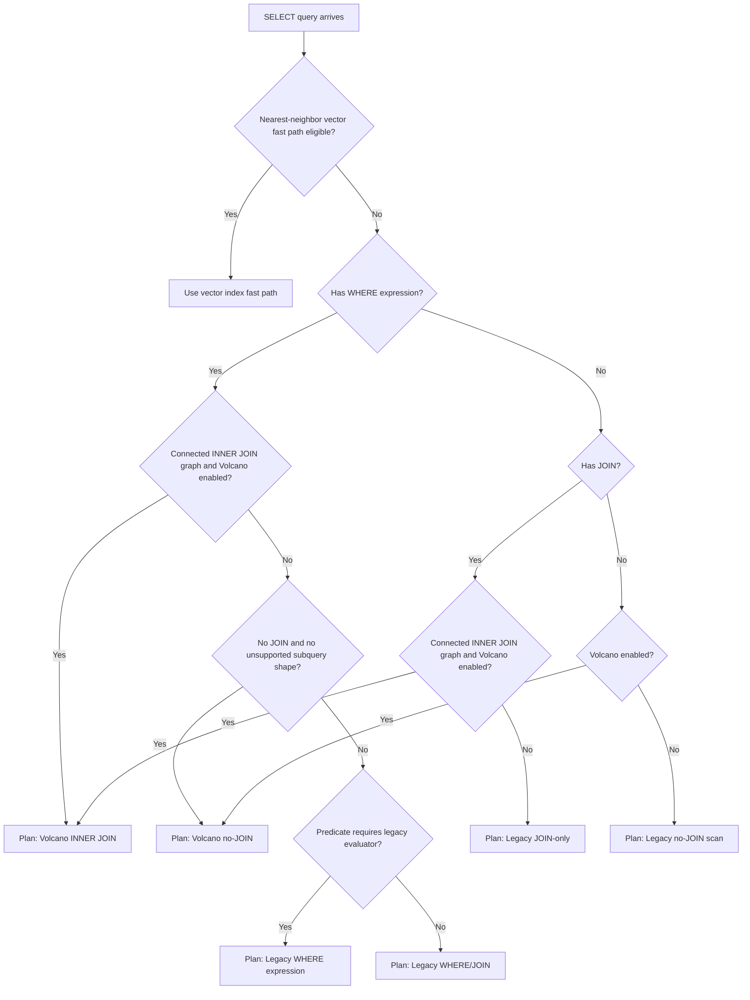
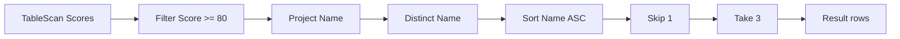
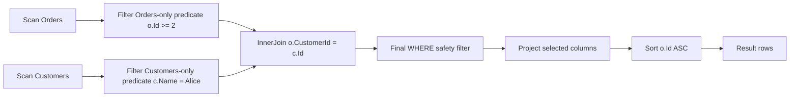
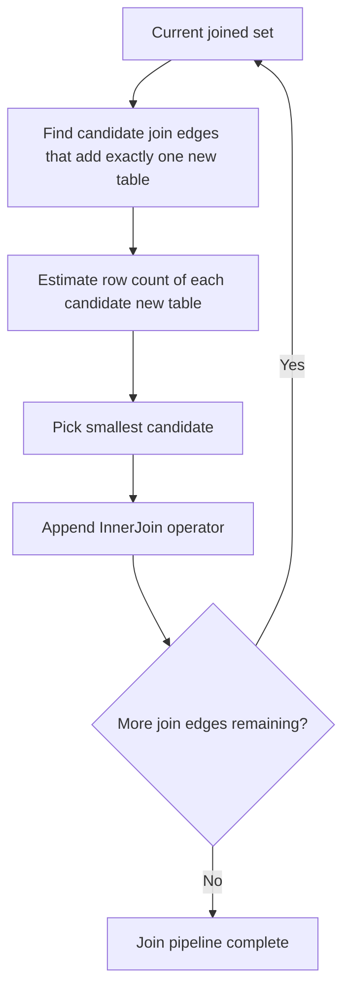

# Volcano Planner and Execution Guide

This page explains what the Volcano work is, why it exists, and how the query planner chooses execution paths.

## What is the "Volcano" thing?

Volcano execution is an operator pipeline model where each operator pulls rows from the previous one.

Instead of always building large intermediate in-memory tables early, we compose operators such as:

- scan
- filter
- join
- project
- distinct
- sort
- offset/limit

This design makes execution easier to optimize because we can push logic earlier in the pipeline (for example, filter rows before joining).

## Why this was implemented

The recent changes focused on three goals:

1. Make planning explicit and explainable.
2. Use Volcano for safe query shapes that benefit from operator pipelines.
3. Keep correctness with conservative fallback to legacy paths when a shape is unsupported.

## Planner Decision Model

The planner now creates a logical decision and maps it to a physical path:

- Volcano no-join
- Volcano inner-join
- Legacy where-expression
- Legacy where-join
- Legacy join-only
- Legacy no-join scan



## Example 1: No-JOIN query pipeline

Query:

```sql
SELECT DISTINCT Name
FROM Scores
WHERE Score >= 80
ORDER BY Name ASC
LIMIT 3 OFFSET 1;
```

Typical Volcano pipeline:



Why this helps:

- Filter and projection happen before distinct/sort.
- Distinct and sort operate on fewer columns and fewer rows.
- Limit/offset can be pushed down safely when ordering semantics are preserved.

## Example 2: INNER JOIN query with table-local predicate pushdown

Query:

```sql
SELECT o.Id, c.Name
FROM Orders o
JOIN Customers c ON o.CustomerId = c.Id
WHERE o.Id >= 2 AND c.Name = 'Alice'
ORDER BY o.Id ASC;
```

Execution shape:



Important safety rule:

- Table-local WHERE parts can be pushed before join.
- Full WHERE is still applied after join to preserve exact query semantics.

## Join ordering heuristic used

For multi-join Volcano plans, the planner currently uses a greedy heuristic:

- from currently joined tables, pick a join edge that connects one new table
- prefer the candidate with smaller row count for the next table

This is not yet a full cost-based optimizer, but it is a practical step that usually reduces intermediate join size.



## Fallback matrix (correctness first)

When a query shape is unsupported or risky for current Volcano rules, planner falls back to legacy execution.

- LEFT/RIGHT/FULL join shapes: fallback
- unsupported subquery shapes in key paths: fallback
- computed predicate cases requiring legacy evaluator: fallback

### Explicit support matrix

| Query shape                                                                    | Volcano path            | Current behavior |
| ------------------------------------------------------------------------------ | ----------------------- | ---------------- |
| Single-table `SELECT` without unsupported subquery shape                       | `VolcanoNoJoin`         | Supported        |
| Connected `INNER JOIN` graph                                                   | `VolcanoInnerJoin`      | Supported        |
| `LEFT JOIN`, `RIGHT JOIN`, `FULL JOIN`, `CROSS JOIN`                           | Legacy                  | Fallback         |
| Correlated subquery forms                                                      | Legacy / rejection path | Fallback         |
| Query requiring legacy-only expression evaluation in planner guard             | Legacy                  | Fallback         |
| Unsupported parenthesized/advanced compound shape beyond current planner rules | Legacy                  | Fallback         |

### Safety contract

- Volcano eligibility is intentionally conservative.
- If planner confidence is low, DataVo uses legacy execution to preserve correctness.
- Fallback selection is considered successful behavior, not an error path.

This is intentional to keep behavior correct while Volcano coverage expands incrementally.

## What to expect next

Roadmap direction for this area:

- stronger cost model (selectivity and cardinality)
- broader join strategy support
- spill-aware sort/aggregate behavior
- deeper reduction of materialization on legacy boundaries
